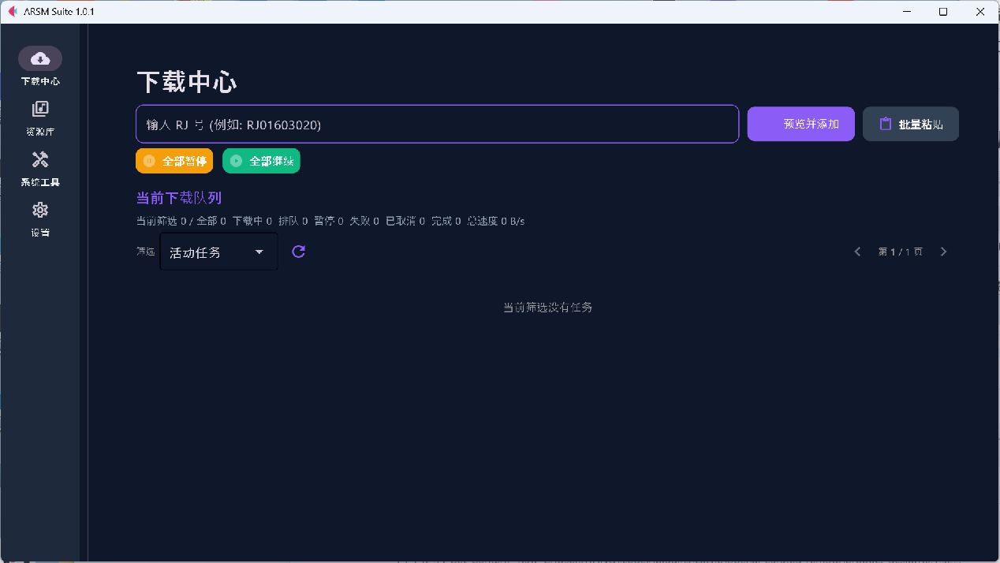
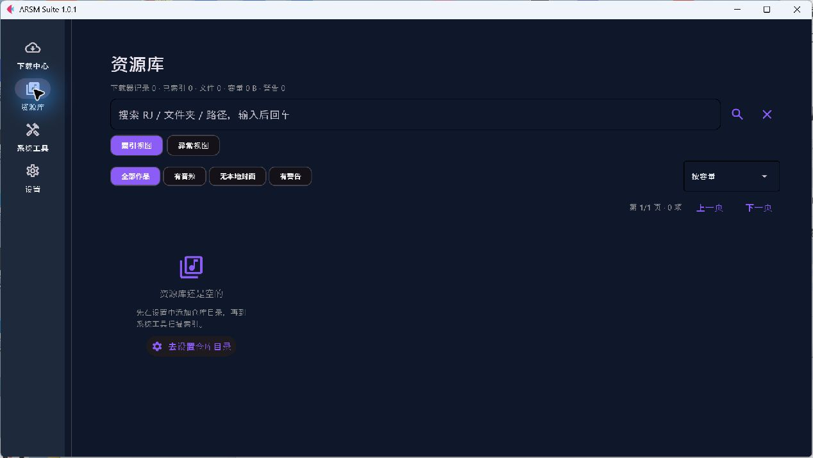
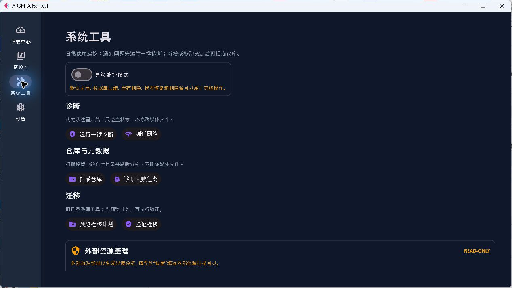
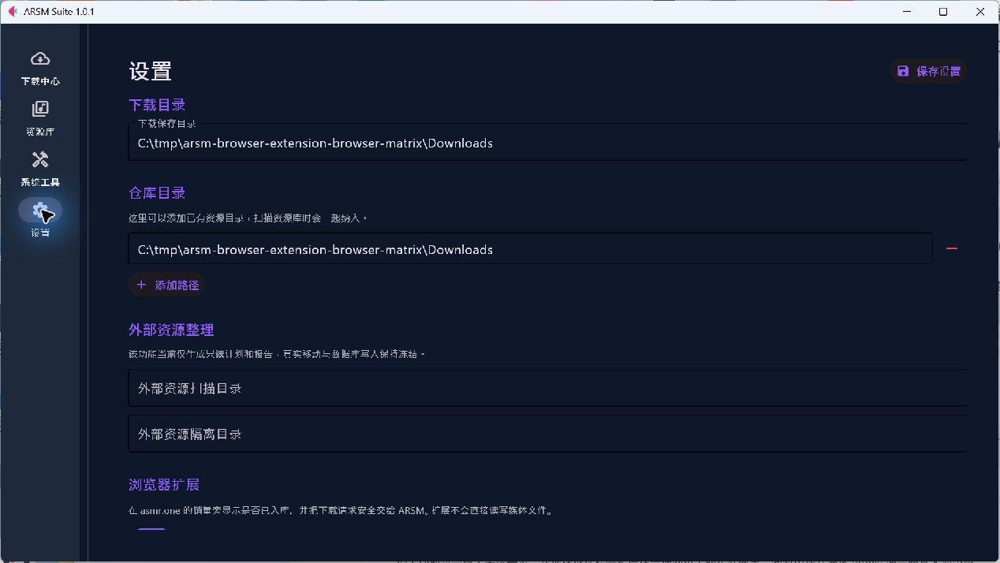
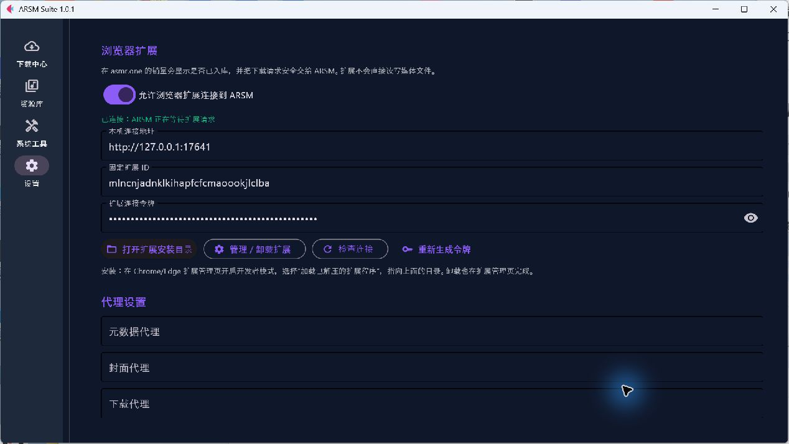
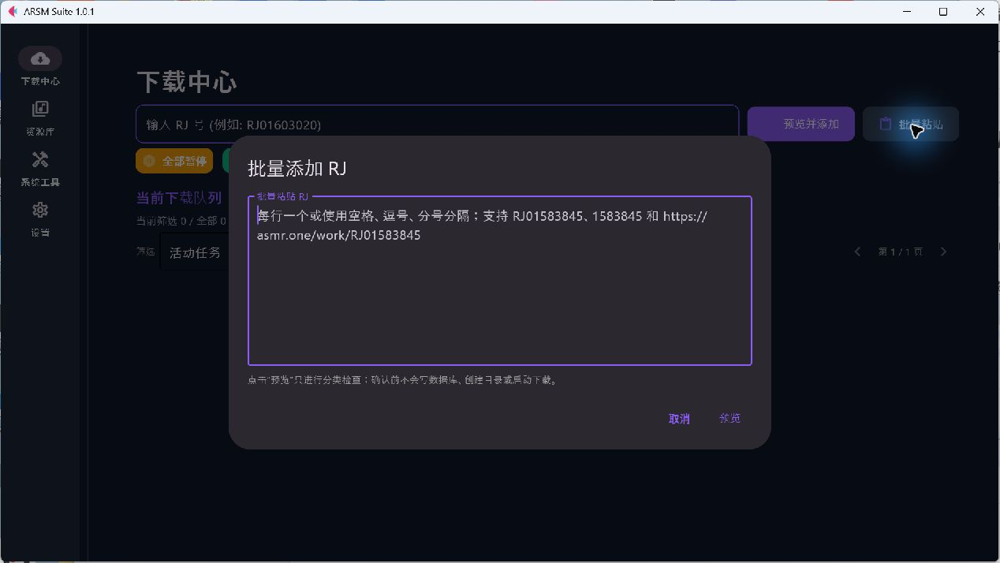
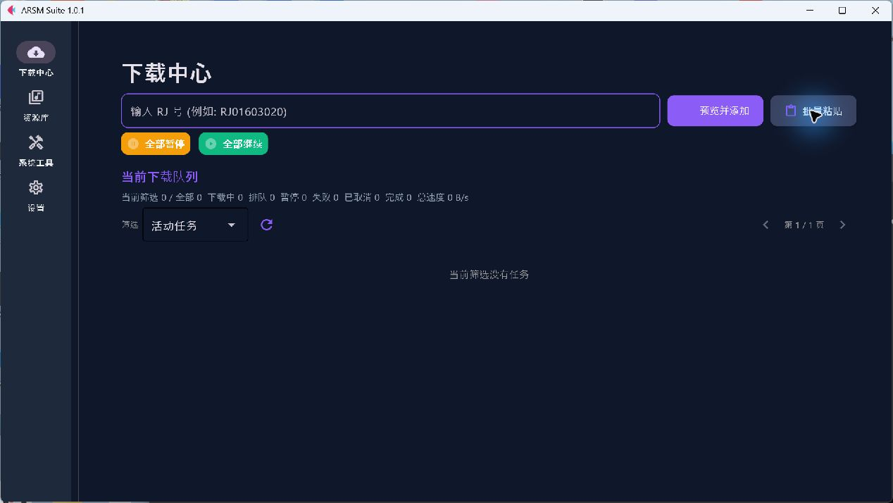

# ARSM Suite 真人用户界面与扩展联调审计

> 审计日期：2026-08-20 至 2026-08-23
> 工作区：`arsm-v101-fix-audit`
> 分支：`codex/asmr-browser-extension`
> 数据边界：只使用隔离 Profile 和空资源库；未读取、移动、覆盖或删除真实媒体。

## 结论先行

桌面端四个主页面无黑屏、异常水平滚动或关键按钮裁切。下载中心主任务清晰，资源库空状态有明确下一步，系统工具的危险边界表达清楚，浏览器扩展设置完整可滚动。

实机发现并修复 1 个明确易用性缺陷：批量粘贴弹窗在 Windows Flet 0.27.6 下按 Escape 不关闭。修复后输入框仍自动获得焦点，按一次 Escape 即关闭弹窗，队列和持久化状态保持不变。

Edge 的 `www.asmr.one` 页面已确认扩展成功注入 8 组状态控件；用户保存隔离 Profile 的地址和令牌后，8 组控件均从“ARSM 未连接”切换为“未入库 / 下载到 ARSM”。设置页新增地址和令牌复制按钮，保留用户主动粘贴的安全边界。Chrome 在 2026-08-23 最终复核时未运行，因此不能写成实机 PASS。

## 当前运行截图

### 1. 下载中心



主 RJ 输入和“预览并添加”是最明显的主操作；批量粘贴作为次操作位置合理。空队列、筛选、分页和全局暂停/继续均可理解。

### 2. 资源库空状态



空状态直接解释“先设置目录，再扫描索引”，并提供“去设置仓库目录”按钮，符合首次使用习惯。

### 3. 系统工具



诊断位于最前，高级维护默认关闭；外部资源整理明确标记 `READ-ONLY`，危险操作没有伪装成日常主按钮。

### 4. 设置页顶部



下载目录、仓库目录和外部资源整理按使用频率分组。页面较长，但所有内容均在同一滚动流内，没有叠层遮挡。

### 5. 浏览器扩展设置



开关、连接状态、本机地址、固定扩展 ID、掩码令牌和安装/卸载入口完整可见；用户需向下滚动一次才能看全操作区，属于可接受的长设置页行为。

### 6. 修复前的批量粘贴弹窗



输入框会自动获得焦点，说明文字明确“预览前无写入”；但修复前按 Escape 不关闭。

### 7. Escape 修复后



按一次 Escape 后弹窗消失并返回下载中心，队列仍为 0。

## 发现与处理

### 已修复

1. 批量粘贴弹窗 Escape 失效
   - 影响：违背常见桌面弹窗习惯，键盘用户必须移动鼠标点击“取消”。
   - 修复：应用级仅分发 Escape 给当前可见页面；下载页只关闭当前批量输入或预览弹窗。
   - 保护：取消路径不入队、不写数据库、不创建目录、不发起网络请求。
   - 自动化：新增应用级键盘分发和弹窗清理测试。
   - 实机：Windows Flet 窗口复测 PASS。

2. 扩展连接参数容易抄错
   - 影响：48 位令牌和本机地址靠人工选择文本，首次连接容易漏字或带空格。
   - 修复：地址和令牌行各增加复制按钮，并在复制后给出短提示。
   - 保护：不自动写入浏览器扩展，不把令牌写入日志或截图。
   - 自动化：新增设置页复制动作与剪贴板契约测试；全量回归覆盖。

### 后续优化建议（不阻塞当前功能）

1. 深色主题的说明文字和空状态文字对比度偏低，可在后续视觉维护中统一提高一级。
2. 左侧导航标签较小，125% 以上缩放时应继续保留文字，不建议改成仅图标。
3. 设置页内容较长；未来如继续增加选项，可考虑页内目录或折叠分组，但当前不值得为此重构。

## 验证

```text
聚焦回归：24 passed
全量回归：410 passed, 3 skipped
跳过原因：当前 Windows 环境不可创建 symbolic link
真实媒体：零读取、零写入、零移动、零删除
```

## 浏览器联调结果与限制

1. Edge `https://www.asmr.one/works?page=21`：8 组控件注入 PASS；
2. 用户保存本机地址与令牌后：8 组控件切换为“未入库 / 下载到 ARSM”，连接状态 PASS；
3. 详情页按钮、测试任务入队、ARSM 退出/重启自动恢复：NOT RUN；
4. 阻塞原因：Codex Browser 的 Edge 控制扩展已安装并启用，但共享原生通信注册项缺失；标签可枚举，接管持续超时。按工具安全边界未自行修改注册表；
5. Chrome：已安装但未运行，NOT RUN；
6. 数据边界：只使用空库隔离 Profile，未访问或修改 `E:\arsm`。